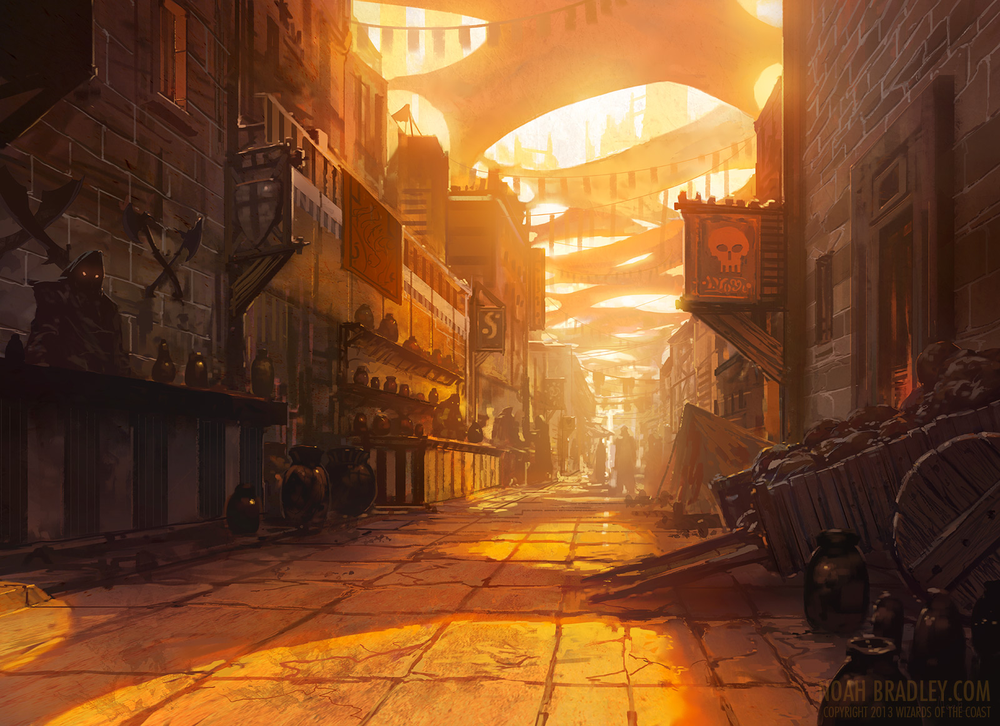
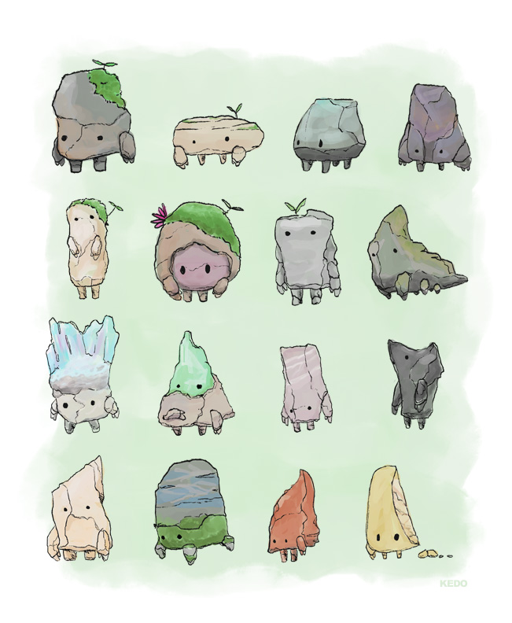

<h1> My own fun project </h1>  
<h6> 7-3-2015_ Part 2 _ Marijn Crum </h6>
- - - -

#### My new idea for the project ####
<h6> My new idea for the free project is about making a jumping game. It is a very simpel concept. You as player must jump over obstracels that are coming in your way. Is the same concept als the must jumping over obstracles game. Here under you see some exampels of what I want to make.</h6>
- - - -

####Examples of obstracle games:####
<h6>

 </h6>

- - - -

#### Special thing of my project  ####

<h6> There is one special thing that make my project difirent from all these jumping over a obstracle game. When you as player want to jump over the obstracle you <i>  DONT PRESS ON Spacebar DONT !!!!</i> offcours not that it will be must to easy. I will make a jumping motion controller. That is my idea. When youhold your hand above the motion controller you don't jump. When you remove your hand than the player will jump.I thing this will make the game much more funn.
</h6>

- - - -
#### The motion controler
<h6>
I have choose the LV_MAXSONAR_EZ1. The reason of that is that you give me that advise to buy this one and I think it is a not very expansive one. <
 

  

It is also very simpel to connect the arduino with these motion controller. This picutere here under tell exactly how you plug in LV_MAXSONAR_EZ1 to the arduino.   

 

Offcours you must plug in your adruino in your pc for the power. Because it won't work. hihi

</h6> 

- - - -

#### Tutorials motion control ####

<h6>
I found some internet links with very helpfull information about how you must code it. 
  

This is one 
<a href="http://www.maxbotix.com/articles/085-pt2.htm#coding" rel="some text"> link</a>. This more about basis information about the motion sensor.
 

The second  <a href="http://playground.arduino.cc/Main/MaxSonar" rel="some text"> link</a>. This more about coding the motion controller.
 

The 3  <a href="https://github.com/Diaoul/arduino-Maxbotix"> link</a>. This more a place where you can find a library for working with9 8 the motion controller.
 

The 4  <a href="http://www.instructables.com/id/Getting-started-with-the-Maxbotix-sonar-sensor-q/#step4"> link</a>. This a very nice toturial and very simpel to understand. How to program the motion sensor and you to plug in de motion sensor to the arduino.
</h6>

- - - -

#### Arduino plug in Eclipse__Tutorials ####

<h6> Here under are some tutorials about how to work with the arduino in the program Eclipse.
  

The first  <a href="http://playground.arduino.cc/Code/Eclipse" rel="some text"> link</a>. This is a very long article about how to controle the arduino though code in the program Eclipse. 

The second  <a href="https://github.com/jantje/arduino-eclipse-plugin" rel="some text"> link</a>. This is a very usefull plug in and explanation about how to connect your arduino with the program Eclipse. 

The 3   <a href="https://github.com/jantje/arduino-eclipse-plugin" rel="some text"> link</a>. This is a tutorial on youtube to set up your arduino in Elipse. 

The 4   <a href="http://horrorcoding.altervista.org/arduino-development-with-eclipse-a-step-by-step-tutorial-to-the-basic-setup/" rel="some text"> link</a>. This is a article about setting up your arduino in Eclipse. 

- - - -

#### The Design & style from my game ####

<h6>
The design of my game will be very onrealistic. It will have much fantasy thing and creatures. I want to make it funny to play. So I think I will use funny sound if your are jumping and that kind of stuff. 
   
I think the enviroment will be something with snow or a street. It will be very simpel so it don't get the whole attention of the player. The attention of the player must go to the player creature and to the obstracles. 
   

Some example of the feeling of my design.

 

 

 

 

 

 

</h6>
